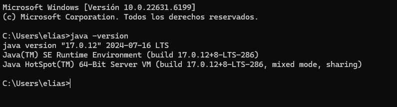
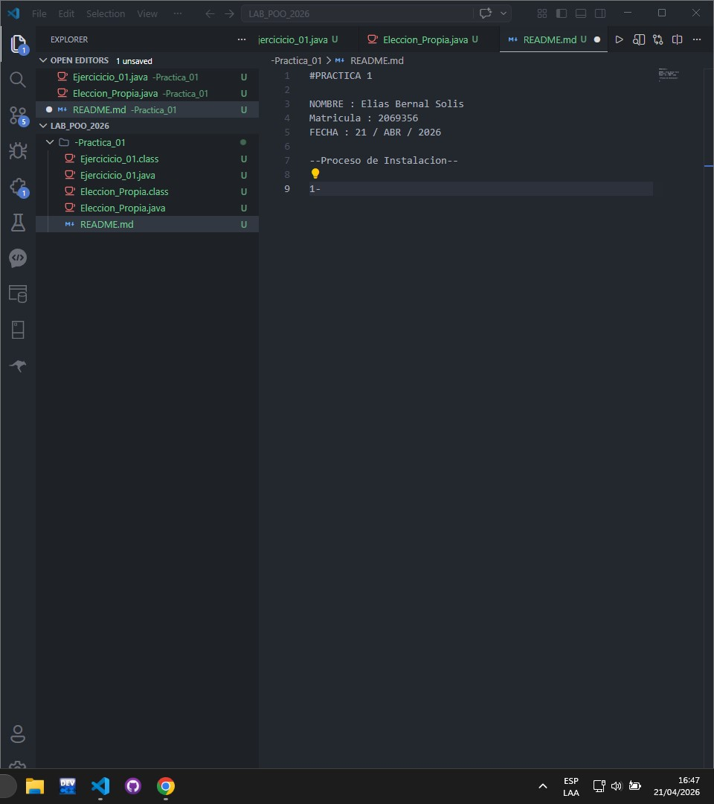

#PRACTICA 1 

NOMBRE : Elias Bernal Solis
Matricula : 2069356
FECHA : 21 / ABR / 2026

--Proceso de Instalacion--

1-CAPTURA DEL JDK INSTALADO Y SU VERSION

2-IDE configurado 

-Justificacion del elemento de decision propia--

Viendo la opcion de las tablas de multiplicar pense en un ciclo for pero no queria hacer lo mismo que los demas asi que recorde que mi mama ahorra 10 pesos al día en una cajita y decidi pasar eso a un ciclo for como decision propia.

El programa trata de un ciclo for con una variable nombrada "n" que representa los días del año y en cada repeticion se aumentan 10 pesos simulando el ahorro que se hace con dicho habito . Esto me ayuda para ver como funciona el ciclo for en JAVA.